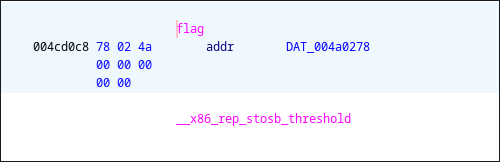
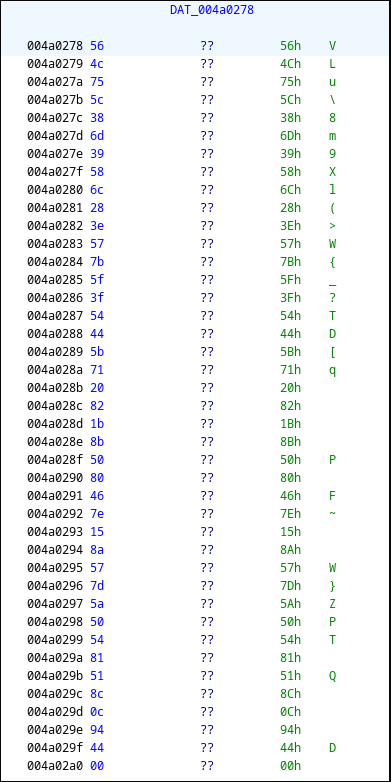

# StrangeVM
We are given `vm` a statically linked ELF binary and `code.pascal` which just contains data. The 
provided `vm` binary implements a **custom virtual machine**. It reads bytecode from `code.pascal`
executes it, and compares the result with a hardcoded **encrypted flag** in memory.

Disassembly reveals that the VM stores the following encrypted flag:


```
564c755c386d39586c283e577b5f3f54445b7120821b8b5080467e158a577d5a505481518c0c9444
```

It also implements the following instructions:

| OPCODE | Name  | Description                     |
|--------|-------|---------------------------------|
| 0      | HALT  | Exit                            |
| 1      | ADD   | mem[addr] += val                |
| 2      | SUB   | mem[addr] -= val                |
| 3      | MOD   | mem[addr] %= val                |
| 4      | STORE | mem[addr] = val                 |
| 5      | INPUT | mem[addr] = input               |
| 6      | JZ    | if mem[addr] == 0, pc += val    |

The instruction formats are as follows:
---

**Immediate-Memory Instructions (ADD, SUB, MOD, STORE)**  
```

1 byte  [OPCODE] | 4 bytes [ADDRESS] | 1 byte [VALUE]

```
---
**HALT Instruction**  
```

1 byte [OPCODE] (0x00)

```
---
**INPUT Instruction** (no immediate value)  
```

1 byte [OPCODE] | 4 bytes [ADDRESS]

````
---

We can inspect the bytecode using `xxd`:

```bash
xxd -i code.pascal
unsigned char code_pascal[] = {
  0x05, 0x00, 0x00, 0x00, 0x00, 0x04, 0x01, 0x00, 0x00, 0x00, 0x00, 0x03,
  0x01, 0x00, 0x00, 0x00, 0x02, 0x06, 0x01, 0x00, 0x00, 0x00, 0x0c, 0x02,
  ...
};
unsigned int code_pascal_len = 1652;
```

We can convert this into a human-readable format using a simple python script (See `convert.py`)

---

Disassembling `code.pascal` yields instructions like:

```
0000: INPUT mem[0]
0005: STORE mem[1] 0
0011: MOD mem[1] 2
0017: JZ mem[1] offset 12
0023: SUB mem[0] 0
0029: JZ mem[1023] offset 6
0035: ADD mem[0] 0
0041: INPUT mem[1]
0046: STORE mem[2] 1
0052: MOD mem[2] 2
0058: JZ mem[2] offset 12
0064: SUB mem[1] 1
0070: JZ mem[1023] offset 6
0076: ADD mem[1] 1
...
```

The instructions from `code.pascal` essentially resolves around a sequence corresponding to 
each input byte `i`.
```
INPUT mem[i]           # Read input byte
STORE mem[i+1] i       # Store index
MOD mem[i+1] 2         # Check parity
JZ mem[i+1] offset 12  # If even, jump to ADD
SUB mem[i] i           # Subtract if odd
JZ mem[1023] offset 6  # Skip ADD (mem[1023] is always 0)
ADD mem[i] i
```

The VM essentially processes each byte of a **41-byte input**, performing:
```python
for i, byte in enumerate(input_file):
    if i % 2 == 0:
        output = input + i
    else:
        output = input - i
```

---

To retrieve the flag, we simply **reverse the transformation** (solving for our input):

```python
#!/usr/bin/env python3

flag_bytes = bytes.fromhex(
    '564c755c386d39586c283e577b5f3f54445b7120821b8b5080467e158a577d5a505481518c0c9444'
)

flag = []
for i in range(41):
    if i % 2 == 0:
        flag.append((flag_bytes[i] - i) & 0xFF)  
    else:
        flag.append((flag_bytes[i] + i) & 0xFF) 

flag = bytes(flag)
print(flag)  # b'VMs_4r3_d14bol1c4l_3n0ugh_d0nt_y0u_th1nk'

with open('test.bin', 'wb') as f:
    f.write(bytes(flag))
```

---

Running the VM with the recovered input gives confirmation.
```bash
python solve.py
b'VMs_4r3_d14bol1c4l_3n0ugh_d0nt_y0u_th1nk'
./vm < test.bin
Congratulations! You have successfully executed the code.
```

Thus we have the flag: **pascalCTF{VMs_4r3_d14bol1c4l_3n0ugh_d0nt_y0u_th1nk}**.
